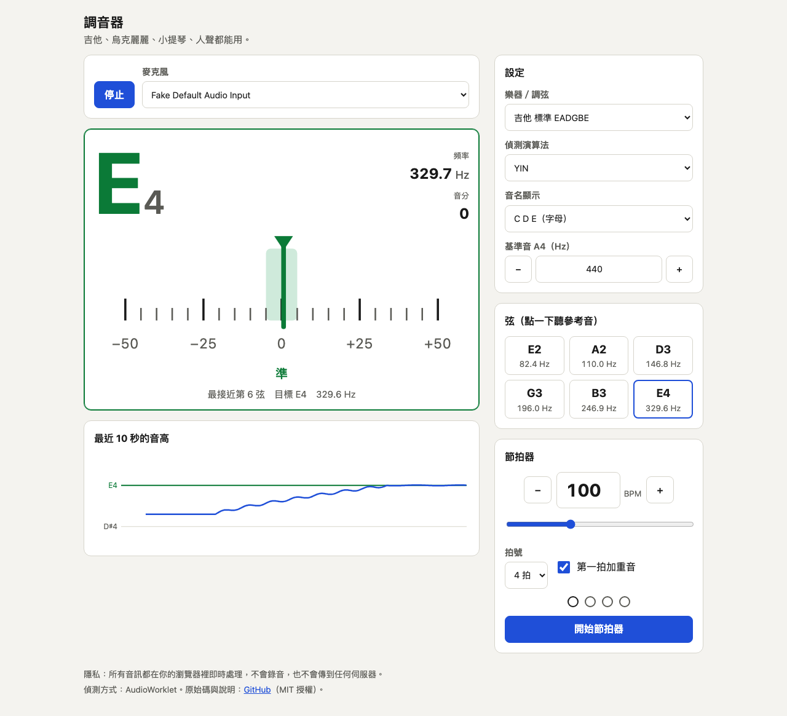

# 調音器
A browser-based instrument tuner (YIN / MPM pitch detection) with reference tones and a metronome. Zero dependencies.

吉他、烏克麗麗、小提琴、人聲都能用的網頁調音器。純靜態網頁，不需要安裝或建置，音訊只在你的裝置上處理，不會上傳。

- Demo：https://useless-husband.github.io/pitch-tuner/



## 功能

- 音高偵測：自己實作的 YIN 演算法（差分函數、累積平均正規化、絕對門檻、拋物線內插），也可以切換成 MPM（McLeod Pitch Method）比較。
- 偵測在 AudioWorklet 裡執行；瀏覽器不支援時自動退回 ScriptProcessor，再退回 AnalyserNode 輪詢。
- 雜訊門檻（RMS）、信心度門檻，再加上中位數平滑，避免指針亂跳與八度跳動。
- 顯示音名（C D E 或 Do Re Mi）、八度、頻率（Hz，小數 1 位）、音分偏差（±50 音分刻度，±5 以內顯示「準」並變色）、最近 10 秒的音高軌跡。
- 樂器模式：半音階（任意音）、吉他標準／Drop D／DADGAD／降半音、烏克麗麗 GCEA、小提琴 GDAE、貝斯 EADG。選了樂器後會自動判斷最接近的弦，並以那條弦為目標顯示偏差。
- 基準音 A4 可調（430–450 Hz，預設 440）。
- 點弦名可以播放參考音（WebAudio 合成，有淡入淡出）。
- 節拍器：30–240 BPM、2–7 拍、第一拍重音；用音訊時鐘加 lookahead 排程，不靠 `setInterval` 決定節奏。
- 麥克風權限流程：先說明用途，被拒絕時列出各瀏覽器怎麼重新開啟，多支麥克風時可選擇裝置。
- 淺色／深色模式（跟隨系統）、手機寬度優先、可用鍵盤操作。

## 安裝與執行

不需要安裝任何東西。這是純靜態網頁，`index.html` 就在專案根目錄。

### 直接用線上版

打開上面的 Demo 網址即可。

### 在自己的電腦上執行

1. 安裝 [Node.js](https://nodejs.org/) 22 以上（只是為了用內附的小伺服器，你也可以用其他靜態伺服器）。
2. 下載或 clone 這個專案，開啟終端機，進入專案資料夾。
3. 執行 `node e2e/serve.mjs 8080`。
4. 用瀏覽器打開 `http://localhost:8080/`。
5. 按「開始調音」，在瀏覽器詢問時選「允許」。

不要直接雙擊 `index.html` 用 `file://` 開啟：ES module 與麥克風在 `file://` 底下都不能用。

### 為什麼一定要 https 或 localhost

瀏覽器把麥克風視為敏感權限，只允許「安全來源」的網頁使用，也就是 `https://` 開頭的網址，或是 `http://localhost`（開發用）。如果你用 `http://192.168.x.x` 這種區域網路位址在手機上開，麥克風會被瀏覽器直接擋掉。要在手機上用，請使用上面的 https Demo 網址。

### iPhone Safari 的麥克風權限

1. 第一次按「開始調音」時，Safari 會跳出詢問視窗，點「允許」。
2. 如果之前按過「不允許」：點網址列左邊的「ぁA」圖示 → 「網站設定」→ 「麥克風」→ 改成「允許」，然後重新整理頁面。
3. 也可以到 iPhone 的「設定 → App → Safari → 麥克風」，把權限改成「詢問」或「允許」。
4. 如果還是沒有聲音，確認沒有其他 App（例如視訊會議）正在佔用麥克風。

## 使用說明

1. 在「設定」選擇樂器或調弦；只是想知道音高就選「半音階」。
2. 按「開始調音」，對著麥克風彈一條弦或唱一個音。
3. 看大字的音名與下面的指針：指針偏左表示偏低（要調高），偏右表示偏高（要調低），落在中間灰色區塊（±5 音分）並顯示綠色的「準」就完成了。
4. 不確定目標音是什麼時，點「弦」區的按鈕聽參考音。播放參考音時，偵測會暫停，避免聽到自己。
5. 樂團要用 442 Hz 之類的基準音時，調整「基準音 A4」。
6. 節拍器可以獨立使用，不需要開麥克風。
7. 「偵測演算法」可在 YIN 與 MPM 之間切換，兩者在多數情況下結果相同，比較有趣的是泛音很強的聲音。

要調貝斯或很低的弦時，請讓麥克風靠近琴身，並在安靜的地方調音。

## 專案結構

```
index.html            頁面（相對路徑，無需建置）
style.css             樣式（淺色／深色）
src/
  yin.js              YIN 演算法
  mpm.js              MPM 演算法
  pitch.js            偵測器（RMS 門檻、信心度）、取樣框組裝、中位數平滑
  notes.js            頻率 <-> 音名／音分、唱名、基準音
  instruments.js      樂器調弦與最近弦判斷
  metronome.js        節拍器排程（可注入時鐘，可測試）
  trace.js            10 秒音高軌跡資料
  mic-errors.js       麥克風錯誤說明
  audio-input.js      麥克風串流（AudioWorklet／ScriptProcessor／Analyser）
  worklet.js          AudioWorklet 處理器
  synth.js            參考音與節拍點擊聲
  app.js              介面邏輯
test/                 單元測試（node --test）
e2e/                  伺服器、假麥克風端對端測試（選用）
docs/screenshot.png   截圖
```

## 如何跑測試

單元測試不需要任何套件，只要 Node.js 22 以上：

```
node --test "test/*.test.js"
```

測試內容：用程式合成的訊號（正弦、鋸齒波、方波、基頻很弱的泛音、Karplus-Strong 撥弦、加固定種子的白雜訊），對 YIN 與 MPM 檢查 E2（82.41 Hz）到 C7（2093 Hz）的誤差是否小於 3 音分、八度錯誤率、靜音與純雜訊時不輸出；另外有音名／音分轉換、A4 基準變化、唱名、各調弦的最近弦判斷、節拍器排程（假時鐘）、平滑與軌跡等。所有雜訊都用固定種子，結果每次都一樣。

端對端測試（選用）用 Playwright 開 Chromium，以 `--use-file-for-fake-audio-capture` 餵入合成的 A4 440 Hz WAV，確認整條流程顯示 A4 且偏差在 ±5 音分以內，並涵蓋三種偵測後備方式。這個專案本身零依賴，所以 Playwright 要自己另外安裝，並用環境變數指定：

```
PLAYWRIGHT_MODULE=/path/to/node_modules/playwright/index.mjs node e2e/fake-mic.e2e.mjs
```

## 原理簡介：YIN 演算法

樂器發出的聲音是週期性的：波形每隔 τ 個取樣點就重複一次，頻率就是 `取樣率 / τ`。YIN 的工作就是找出這個週期 τ。

```
波形     ╭╮  ╭╮  ╭╮  ╭╮  ╭╮  ╭╮
        ─╯╰──╯╰──╯╰──╯╰──╯╰──╯╰─
         |<-- τ -->|

把波形往右平移 τ，與原波形相減：
  平移量 = τ  ->  幾乎完全重合，差值接近 0
  平移量 ≠ τ  ->  對不齊，差值很大
```

1. 差分函數：`d(τ) = Σ (x[j] − x[j+τ])²`，衡量平移 τ 之後「差多少」。
2. 累積平均正規化：`d'(τ) = d(τ) · τ / Σ d(k)`。原本的 d(τ) 在 τ 很小時也會很小，容易誤判；正規化後 d' 從 1 開始，只有真正對齊的地方才會掉到接近 0。
3. 絕對門檻：從小到大找第一個低於門檻（本專案為 0.15）的谷底。取「第一個」而不是「最低的」，可以避開二倍週期（低八度）的錯誤。
4. 拋物線內插：谷底只落在整數 τ，用左中右三點擬合拋物線，得到小數位置。對高音（例如 C7 一個週期只有約 21 個取樣點），另外量測連續 k 個週期再除以 k，把內插誤差縮小 k 倍。

信心度是 `1 − d'(τ)`；太低（或音量低於 RMS 門檻）就視為沒有音高。

MPM 走同樣的思路，但改用正規化平方差函數（NSDF，值域 −1 到 1），找出每段正值區間的峰值，再選「第一個高度達到最高峰 93% 的峰」。

## 已知限制

- 麥克風收到的是所有聲音；有背景音樂或和弦（多個音同時響）時，單音偵測不準。
- 貝斯與很低的弦需要較長的取樣窗，反應會比高音慢一點。
- 手機的內建麥克風對低頻靈敏度較差，貝斯建議靠近琴身。

## 授權

MIT，見 [LICENSE](LICENSE)。
